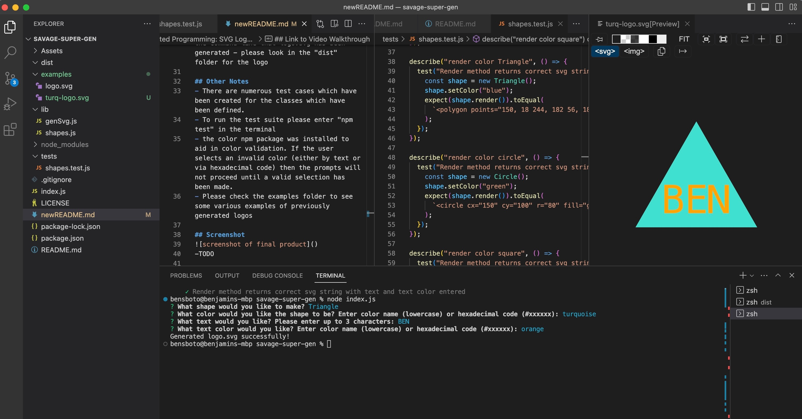

# 10 Object-oriented Programming: SVG Logo Maker

## Acceptance Criteria

```md
GIVEN a command-line application that accepts user input
WHEN I am prompted for text
THEN I can enter up to three characters
WHEN I am prompted for the text color
THEN I can enter a color keyword (OR a hexadecimal number)
WHEN I am prompted for a shape
THEN I am presented with a list of shapes to choose from: circle, triangle, and square
WHEN I am prompted for the shape's color
THEN I can enter a color keyword (OR a hexadecimal number)
WHEN I have entered input for all the prompts
THEN an SVG file is created named `logo.svg`
AND the output text "Generated logo.svg" is printed in the command line
WHEN I open the `logo.svg` file in a browser
THEN I am shown a 300x200 pixel image that matches the criteria I entered
```

## Developer Notes
- This application uses a CLI with the inquirer prompt to accept user input to generate 
a logo.
- to start the app please run the command "node index.js" in the integrated terminal
- You will first be prompted to select which overall shape you'd like to make, use the arrow keys to make a selection. 
- Enter the color for the shape. This can be in lowercase general colors or valid hexadecimal codes. If you enter an invalid selection you'll be prompted to correct it.
- Next, enter up to 3 characters for your logo. If you enter more than 3 you'll get an error and will be prompted to correct it. 
- Finally, enter color for the Text entered. This can be in lowercase general colors or valid hexadecimal codes. If you enter an invalid selection you'll be prompted to correct it (delete the invalid selection and type something valid).
- A successful result will notify you on the command line that logo.svg has been generated - please look in the "dist" folder for the logo

## Other Notes
- There are numerous test cases which have been created for the classes which have been defined. 
- To run the test suite please enter "npm test" in the terminal
- the color npm package was installed to aid in color validation. If the user selects an invalid color (either by text or via hexadecimal code) then the prompts will not proceed until a valid selection has been made. 
- Please check the examples folder to see some various examples of previously generated logos

## Screenshot
Please see screenshot below of final app:



## Link to Video Walkthrough
Please follow the link below to view walkthrough video
- https://drive.google.com/file/d/1uk_e5ipkUIwHlD-QFZiHiPfkb-Ukz_BB/view
